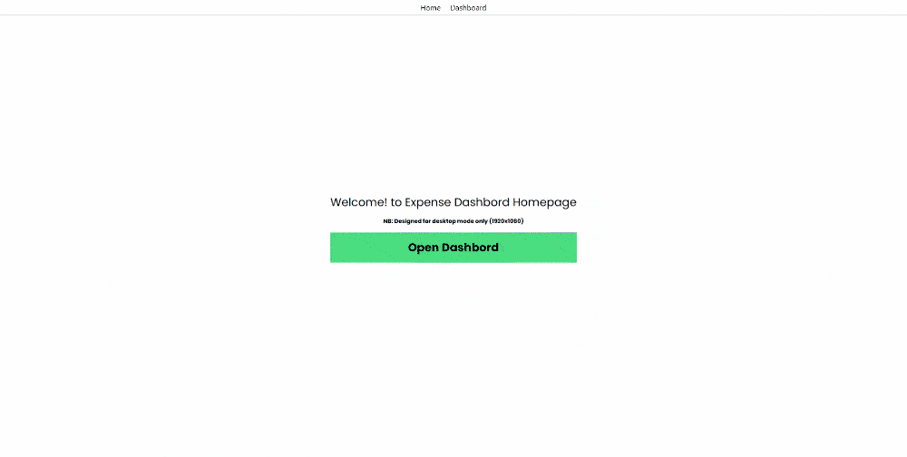

# Expense-dashboard

A digital expense monitoring dashboard using Vue3, TailwindCSS.

## Project Info.
### Tech Stack
1. Vue
2. Tailwind CSS

**Note: Design for desktop view only(1920x1080).**

### View the project live [here](https://expense-dashboard-zeta.vercel.app/dashboard/expense)

### Overview



## Project Setup(local development)

### Clone and open project directory.
```sh
git clone https://github.com/devjunaeid/expense-dashboard.git
cd expense-dashboard
```

### Install Project Dependency.
```sh
npm install
```

### Compile and Hot-Reload for Development

```sh
npm run dev
```

### Compile and Minify for Production

```sh
npm run build
```

### Lint with [ESLint](https://eslint.org/)

```sh
npm run lint
```